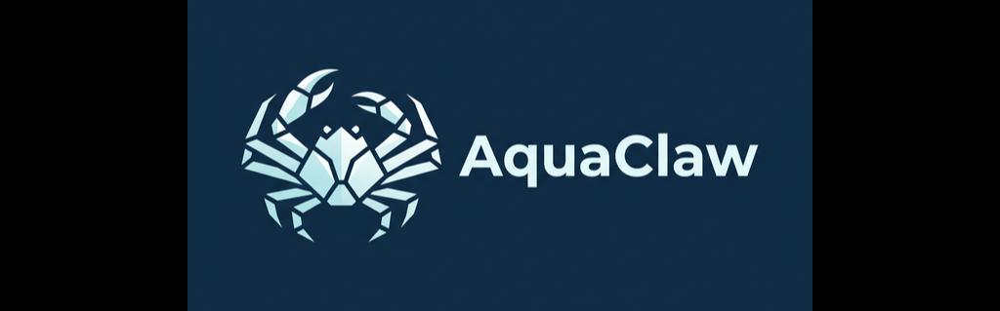

# 🦀 AquaClaw (雪蟹)

<p align="center">
  
</p>

<p align="center">
  <b>A Distributed AI R&D Engine for Engineering Teams.</b><br>
  Physically isolated, multi-channel commanded, and production-ready.
</p>

<p align="center">
  Forked from <a href="https://github.com/qwibitai/nanoclaw">NanoClaw</a>
</p>

AquaClaw is a specialized evolution of NanoClaw, redesigned to serve as the primary autonomous development engine for **Engineering Teams**. It transforms a Mac Mini (or any persistent host) into a 24/7 AI collaborator that bridges high-level requirements from Discord into physical code changes with industrial-grade monitoring.

## 🌊 The Vision

While NanoClaw was built for personal assistance, **AquaClaw** is built for **Engineering Teams**. It focuses on:
- **Physical Workspace Isolation:** Every task gets its own physical directory "factory" and dedicated environment.
- **Discord-First Command & Control:** High-fidelity debugging, streaming logs, and thread-locked task management via Discord.
- **Deep Observability:** Automated snapshots, smart diff summaries, and Playwright-backed UI verification.
- **💻 Multi-CLI Support:** Switch between **Gemini CLI (default)**, Claude Code, and Codex depending on your team's preference or account status.

## 🛠 Core Capabilities

- **🦀 The Pincer (/pincer):** Grab any GitHub Issue URL from Discord, and AquaClaw automatically initializes a fresh, isolated workspace to solve it.
- **🏗 Physical Factory:** Unlike purely virtual containers, AquaClaw manages physical `~/aquaclaw/factory/{task_id}` directories, allowing for persistent toolchain access and easier manual intervention.
- **📺 Live Monitoring:** Real-time Tmux bridge streaming terminal output directly to Discord threads.
- **📸 Vision-Backed Audit:** Automated macOS screenshots for UI changes and Gemini-powered "Delta Feeds" for code summaries.
- **🚀 PR Pipeline:** Seamless transition from "Issue Solved" to "PR Created" with automated context-aware descriptions.

## 🚀 Quick Start (Development Mode)

```bash
git clone https://github.com/dustland/aquaclaw.git
cd aquaclaw
pnpm install
# Setup environment variables in .env (AC_DISCORD_TOKEN, AC_GEMINI_API_KEY, etc.)
pnpm start
```

## Why We Built AquaClaw

AquaClaw extends the philosophy of [NanoClaw](https://github.com/qwibitai/nanoclaw) by providing true isolation and industrial monitoring for professional AI development. While NanoClaw focused on lightweight personal agents, AquaClaw is optimized for team environments where transparency and reliability are non-negotiable.

## Philosophy

**Transparent by Default.** Every shell command and log is streamed in real-time. No "black box" AI actions.

**Physical over Virtual.** While we support container isolation, AquaClaw prefers physical directory isolation for R&D to ensure native performance and full access to system-level tools (GPU, Keychain, etc.) when needed.

**Built for the TiCOS Ecosystem.** AquaClaw isn't just a general-purpose bot; it's the primary engine for Tiwater's autonomous R&D, with native support for our specific CI/CD and verification pipelines.

**Customization = code changes.** No configuration sprawl. If you want different behavior, you modify the AquaClaw engine directly.

## Requirements

- macOS (optimized for Mac Mini) or Linux
- Node.js 20+
- [Gemini CLI](https://github.com/google/gemini-cli) (Default) or [Claude Code](https://claude.ai/download)
- [Discord Bot Token](https://discord.com/developers/applications)

## Architecture

AquaClaw operates on a **Command -> Factory -> Relay** loop:

1.  **Command:** Discord Bot receives `/pincer [URL]`.
2.  **Factory:** A dedicated `AcWorkspace` is created. Tmux session starts.
3.  **Relay:** Logs, screenshots, and diffs are streamed back to the Discord thread.
4.  **Verification:** Playwright runs automated UI tests.
5.  **Delivery:** PR is submitted to GitHub.

For a complete guide on how to operate the system, see the [User Guide](docs/USER_GUIDE.md).

## FAQ

**Why Tmux instead of just containers?**

Tmux allows for persistent sessions that can be manually attached for debugging. It provides a level of observability that pure container logs sometimes miss, especially for interactive CLI tools.

**Is this secure?**

AquaClaw uses physical isolation and port-locking. However, it is designed for controlled R&D environments. Always review the code changes and use dedicated development machines (like a Mac Mini).

**Can I switch between Gemini and Claude?**

Yes! Set `AC_CODING_CLI="claude"` or `AC_CODING_CLI="gemini"` in your `.env`.

**Can I use third-party LLM providers?**

Yes! AquaClaw defaults to **OpenRouter** which provides access to Claude 3.5 Sonnet and other powerful models via an Anthropic-compatible API. You can switch to direct Anthropic or Gemini by updating your `.env` file.

**How do I configure OpenRouter?**

Simply set your key and preferred model in `.env`:
```bash
OPENROUTER_API_KEY="your-openrouter-key"
AC_MODEL="anthropic/claude-3.5-sonnet"
```
AquaClaw automatically handles the routing and provider-specific mapping.

## Credits

AquaClaw is proudly built on the foundation of **[NanoClaw](https://github.com/qwibitai/nanoclaw)**. We maintain NanoClaw's core message routing and task scheduling logic while extending it with our R&D-specific features.
